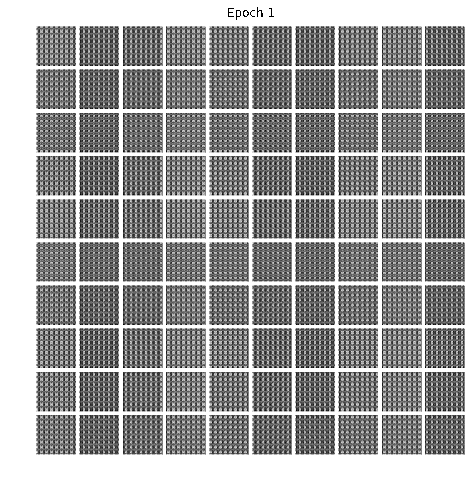

# GANasso - Generative Adversarial Network Picasso
Pytorch implementation of conditional Generative Adversarial Networks (cDCGAN) and Auxiliary Classifier Generative Adversarial Networks (ACGAN) for MNIST, CIFAR10 and custom dataset.

* report folder contains a report of this implementation. Look that if you want to get more deep into details

* We used both cDCGAN and ACDCGAN to generate 64x64 paintings from total of 4 different labels.

* you can download
  - MNIST dataset: http://yann.lecun.com/exdb/mnist/ (or torchvision)
  - CIFAR10 dataset: https://www.cs.toronto.edu/~kriz/cifar.html (or torchvision)
  - Wikiart/GANgogh dataset: http://academictorrents.com/details/1d154cde2fab9ec8039becd03d9bb877614d351b
  - Flower dataset: http://www.robots.ox.ac.uk/~vgg/data/flowers/102/.
## Results

### MNIST and two labels
* Generated using fixed noise. Epochs for mnist are 10 and for two labels are 150

<table align='center'>
<tr align='center'>
<td> MNIST</td>
<td> Two labels from our dataset <td>
</tr>
<tr>
<td></td>
<td></td>
</tr>
</table>

* Training Time
  * MNIST cDCGAN - Avg. per epoch: 120 sec; Total 10 epochs: 1200 sec
  * MNIST cDCGAN - Avg. per epoch: 3 min; Total 150 epochs: 450 min
  
### Cifar10
* Generated using fixed noise on Google Colab. Trained for 150 epochs.

<table align='center'>
<tr align='center'>
<td> Cifar10 </td>
</tr>
<tr>
<td></td>

</tr>
</table>
  
  
  

### 4 different
* Generated using fixed noise and 4 different labels. Labels are portraits, abstracts, landscapes and flowers

<table align='center'>
<tr align='center'>
<td> ACDCGAN image generation with 4 different labels</td>
</tr>
<tr>
<td></td>
</tr>
</table>

## Development Environment

* Windows 10
* NVIDIA GTX 1070
* cuda 8.0
* Working environment: misc/environment.yml

* Also works on Google Colab, but requires bit tuning. Cifar10 and ACGAN are trained on Google Colab.

Inspired by great implementation GANGogh (https://github.com/rkjones4/GANGogh) and other GAN implementations found from GitHub.
